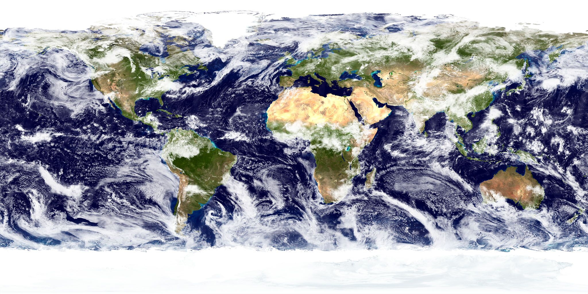

 - three.js     
    舞台 Scene  
    灯光 Light  
    相机 Camera 
    元素 mesh   
    按帧刷新    requestAnimationFrame   
    渲染器 renderer     
    渲染到 canvas : render  canvas

    性能监视器 stats

    [three.js 相机](https://www.cnblogs.com/cndotabestdota/p/5746053.html)

 - 
    